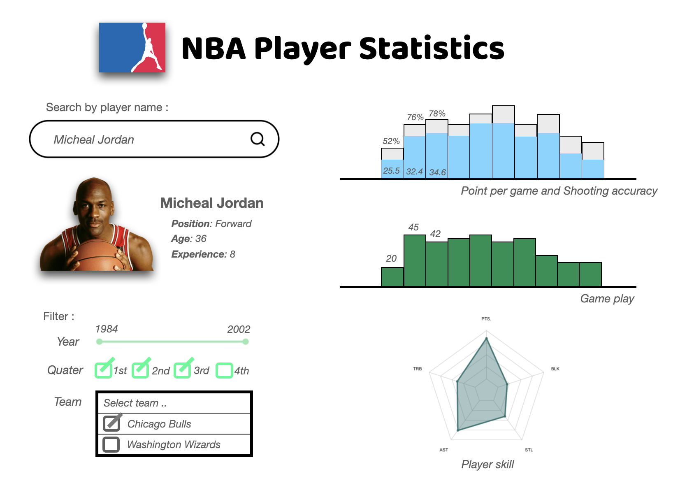

# NBA Player Performances

***A comprehensive NBA player data visualization dashboard application.***

## Welcome!

Welcome! to the repository of the NBA Performance App  :confetti_ball:  ！

Thank you for visiting the STEMM Role Models app project repository.

This document (the README file) is a hub to give you some information about the project. Jump straight to one of the sections below, or just scroll down to find out more.

* [What are we doing? (And why?)](#what-are-we-doing)
* [Who are we?](#who-are-we)
* [What do we need?](#what-do-we-need)
* [How can you get involved?](#get-involved)
* [Get in touch](#contact-us)
* [Find out more](#find-out-more)
* [Understand the jargon](#glossary)

## Description of App

The visualization app contains a landing page that shows NBA player performances. The visualization comprises the data of over 500 NBA players among 30 NBA teams. This app aims to help enthusiast NBA fans to understand better and assess NBA player performances.

The visualization is designed to display multiple statistics of NBA players. The app allows users to search for an interested NBA player by name with a search box item, for example, "Micheal Jordan", the app then shows the corresponding player's information. Furthermore. the users then are able to filter and scope the performances of the players with three types of filters,

- A slider of the year the player plays in NBA. 

- Tick boxes of the quarter of the player plays.

- A multiple check box of the team the player plays for. 

We aim to offer three charts of player performances; Scoring performance(Point per game, Shooting accuracy), Game play(Number of games), and Skill indicators(Point per game, Total Rebound per game, Assist per game, Steal per game, and Block per game). These will show the player's performances according to the player search and its filter.

Therefore, users can study each NBA player's performance in detail and understand more about the player they are interested in.

## Sketch

## Contributors
The contributors of this project are Peng Zhang, Fujie Sun, Chen Lin, and Nate Puangpanbut.

# License
`nba_player_stat` is licensed under the terms of the MIT license.
Please refer to the License File [here](https://github.com/UBC-MDS/nba_player_stat/blob/main/LICENSE)
