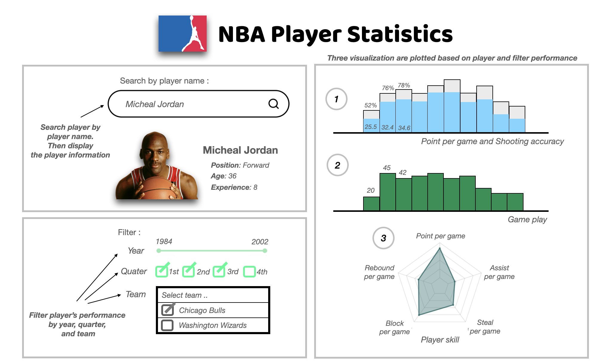

# NBA Player Performances

***A comprehensive NBA player data visualization dashboard application.***

## Welcome!

Welcome! to the repository of the NBA Performance App  :confetti_ball:  ！

Thank you for visiting our project,hope all of you can enjoy browsing the NBA player performance.

This document (the README file) is a hub to give you some information about the project. Jump straight to one of the sections below, or just scroll down to find out more.

* [What are we doing?](#what-are-we-doing)
* [Description of App](#description-of-app)
* [Sketch](#sketch)
* [Contributors](#contributors)
* [How can you get involved?](#get-involved)

## What are we doing?

### The problem

* Women and other minorities are less likely to be invited to speak at academic and tech conferences
* Women are less likely to promote themselves: they are more likely to suffer from the [imposter syndrome][link_impostersyndrome]
* It's difficult for conference organisers to know how good an invited speaker will be if they haven't seen them present before

So, if even the very best intentioned conference organisers (who know the powerful and supportive effects that seeing a diverse panel of presenters have for under-represented groups) have mostly seen presentations by (straight, white, cis-gendered) men then they're likely to invite men again. And so the cycle continues.

### The solution

The STEMM Role Models app will:

* Improve visibility for researchers and developers by making a database that is easy to search with customizable keywords
* Allow anyone to add researchers so the database can grow without relying on women promoting themselves
* Provide information that is useful for making decisions on key note invitations such as links to blogs, social media, journal articles, youtube clips, a list of previous invited presentations and testimonials.

Everyone in the database will have the opportunity to identify themselves as one or more of a selection of different under-represented groups in STEMM. The goal is to ensure that ***conference organisers are able to access a diverse and representative group of the most exciting researchers in their field from around the world***.

## Description of App

The visualization app contains a landing page that shows NBA player performances. The visualization comprises the data of over 500 NBA players among 30 NBA teams. This app aims to help enthusiast NBA fans to understand better and assess NBA player performances.

The visualization is designed to display multiple statistics of NBA players. The app allows users to search for an interested NBA player by name with a search box item, for example, "Micheal Jordan", the app then shows the corresponding player's information. Furthermore. the users then are able to filter and scope the performances of the players with three types of filters,

- A slider of the year the player plays in NBA. 

- Tick boxes of the quarter of the player plays.

- A multiple check box of the team the player plays for. 

We aim to offer three charts of player performances; Scoring performance(Point per game, Shooting accuracy), Game play(Number of games), and Skill indicators(Point per game, Total Rebound per game, Assist per game, Steal per game, and Block per game). These will show the player's performances according to the player search and its filter.

Therefore, users can study each NBA player's performance in detail and understand more about the player they are interested in.

## Sketch

## Contributors
The contributors of this project are Peng Zhang, Fujie Sun, Chen Lin, and Nate Puangpanbut.

## Get involved

If you think you can help in any of the areas listed above (and we bet you can) or in any of the many areas that we haven't yet thought of (and here we're *sure* you can) then please check out our [contributors' guidelines](CONTRIBUTING.md) and our [roadmap](../../issues/1).

Please note that it's very important to us that we maintain a positive and supportive environment for everyone who wants to participate. When you join us we ask that you follow our [code of conduct](CODE_OF_CONDUCT.md) in all interactions both on and offline.

# License
`nba_player_stat` is licensed under the terms of the MIT license.
Please refer to the License File [here](https://github.com/UBC-MDS/nba_player_stat/blob/main/LICENSE)
